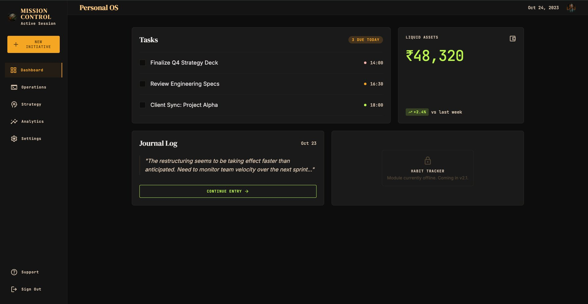
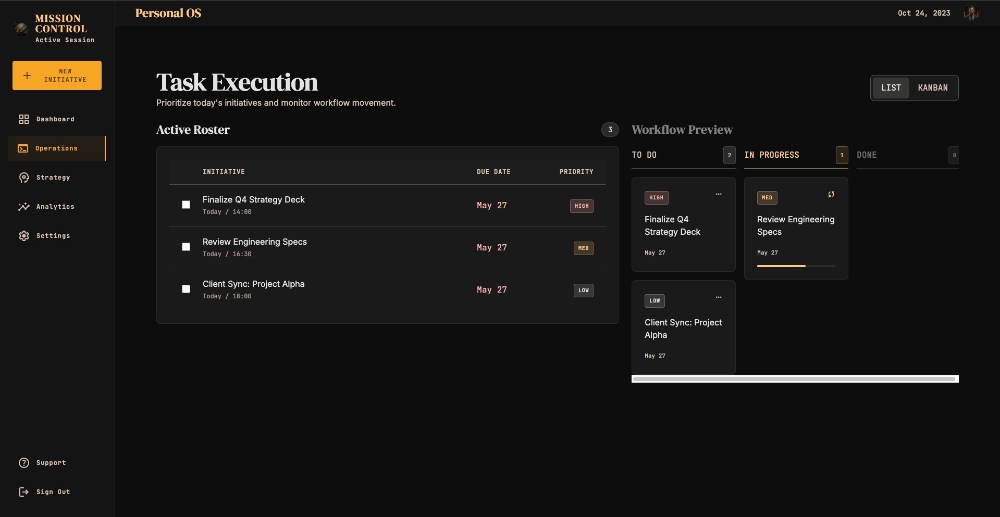
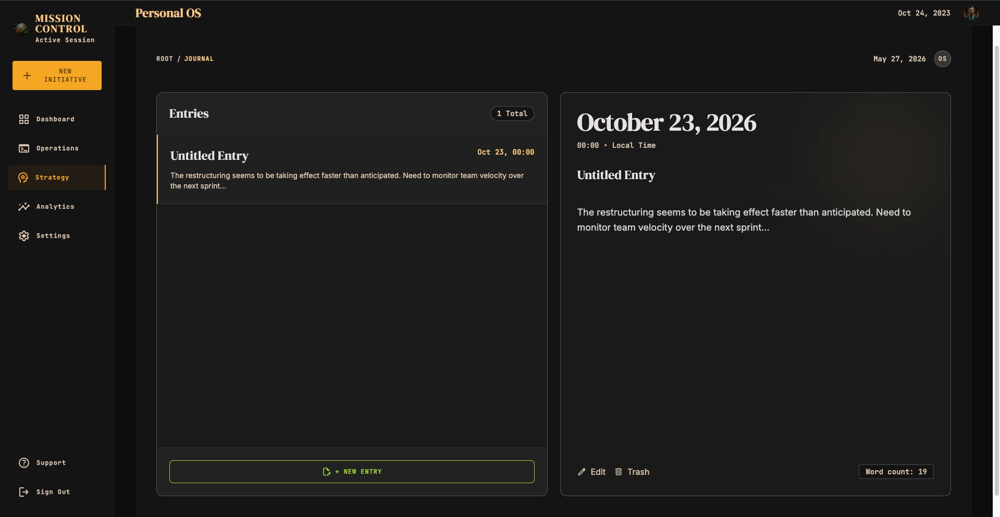
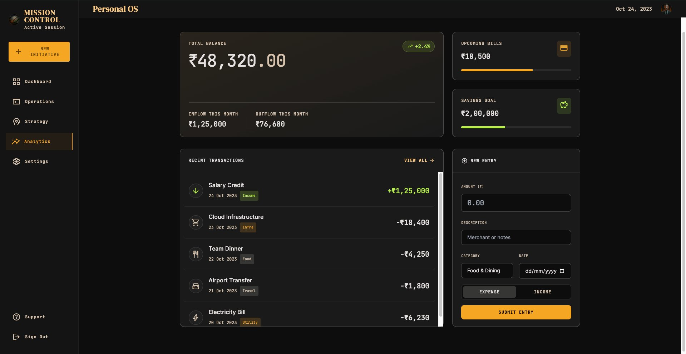
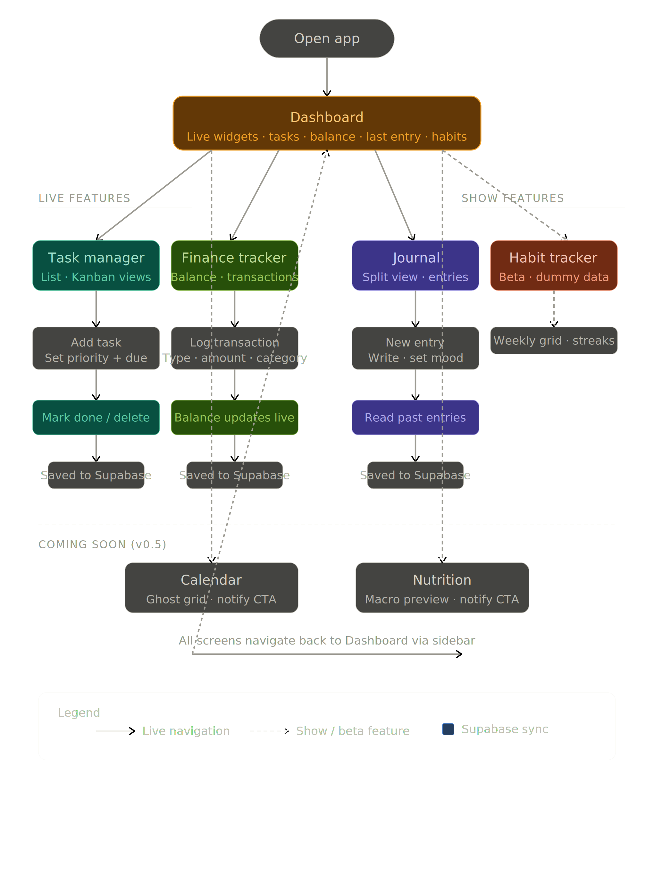

# Personal OS

One command center for a solo professional's tasks, finances, and journal.


Personal OS is a dark-mode desktop dashboard for solo professionals, freelancers, and indie builders who manage work, money, and personal notes across too many disconnected tools. The app currently ships a React/Vite MVP with a dashboard, task execution screen, finance tracker, journal reader/editor, and placeholder modules for calendar, habits, and nutrition.

## Screenshots / Demo

### Dashboard



### Task Execution



### Journal



### Finance Tracker



### User Flow



## The Problem

Solo professionals often run their work-life from a stack of disconnected tools: tasks in one app, money in a spreadsheet, thoughts in notes, and habits somewhere else. That fragmentation makes the morning scan harder than it should be, and it prevents the user from seeing how priorities, spending, and reflection connect. Personal OS solves this by collapsing the daily operating view into one dashboard with focused modules for execution, finances, and journaling. The product brief frames the bigger goal as portable personal data that can later live in a cloud memory system and become AI-queryable.

## Key Features

### App Shell

- **Mission Control sidebar**: Desktop navigation with active-route styling, Material Symbols icons, logo mark, and links for Dashboard, Operations, Strategy, Analytics, Settings, Support, and Sign Out.
- **Global header**: Persistent `Personal OS` title, static session date, and avatar image.
- **Shared UI primitives**: Reusable card surfaces, priority badges, delta badges, progress bars, primary buttons, ghost buttons, and locked module cards.

### Dashboard

- **Today's task summary**: Filters mock tasks due today, shows a due-today count, task titles, completion state, priority dots, and scheduled times.
- **Liquid assets card**: Displays current balance in INR and a positive/negative delta badge.
- **Journal preview**: Shows the latest journal date and first sentence with a continue-entry call to action.
- **Locked habit module**: Shows the habit tracker as offline with a blurred placeholder treatment and v2.1 coming-soon message.

### Task Execution

- **Active roster**: Normalizes task data into category, due date, status, and progress fields for display.
- **Local completion state**: Checkboxes add or remove task IDs from local completed state and update the list styling.
- **Priority badges**: Renders high, medium, and low task priority with distinct visual treatments.
- **Due-date urgency**: Colors due dates based on whether they are overdue/today, near-term, or later.
- **List/Kanban control**: Provides a segmented control for List and Kanban modes.
- **Workflow preview**: Groups tasks into To Do, In Progress, and Done columns, with a progress bar for in-progress work.

### Finance Tracker

- **Balance hero**: Shows total balance, percentage delta, monthly inflow, and monthly outflow.
- **Finance stat cards**: Shows upcoming bills and savings goal with icons and progress bars.
- **Recent transactions**: Sorts mock transactions by date, limits the initial view to five, and displays category icons, category pills, dates, and income/expense signs.
- **New entry form**: Captures amount, description, category, date, and expense/income type, then prepends a local transaction when valid.
- **INR formatting**: Formats balances and transactions using Indian numbering.

### Journal

- **Split-panel journal layout**: Keeps the entry list and reader/editor panel side by side with independent scrolling.
- **Entry selection**: Lets users select an entry from the list and read the formatted entry in the detail panel.
- **New entry composer**: Adds a local journal entry with title, timestamp, content, and paragraph splitting.
- **Date formatting**: Supports long dates, short dates, and "Today" labels from entry metadata.
- **Word count**: Calculates and displays the selected entry's word count.
- **Critical path support**: Renders optional checklist-style critical path items when entry data includes them.
- **Edit and trash controls**: Displays reader actions for future edit/delete behavior.

### Placeholder Modules

- **Calendar**: Route exists and displays `Calendar - coming next`.
- **Habits**: Route exists and displays `Habits - coming next`.
- **Nutrition**: Route exists and displays `Nutrition - coming next`.

## Tech Stack

| Technology | Purpose | Notes |
| --- | --- | --- |
| React | UI framework | `react` and `react-dom` `^18.3.1`. |
| React Router DOM | Client-side routing | `BrowserRouter`, `Routes`, `Route`, and `NavLink`; version `^6.28.0`. |
| Vite | Local dev server and production build | Version `^6.0.5`; scripts are `dev`, `build`, and `preview`. |
| @vitejs/plugin-react | React support for Vite | Version `^4.3.4`. |
| Tailwind CSS | Utility-first styling and design tokens | Version `^3.4.17`; configured in `tailwind.config.js`. |
| PostCSS | CSS processing | Version `^8.4.49`; wired through `postcss.config.js`. |
| Autoprefixer | Vendor prefixing | Version `^10.4.20`. |
| JavaScript ES modules | Application language/module format | `package.json` sets `"type": "module"`. |
| Google Fonts | Typography | Loads DM Serif Display, Inter, and JetBrains Mono from `fonts.googleapis.com`. |
| Material Symbols Outlined | Icon system | Loaded from Google Fonts and used throughout navigation, cards, buttons, and forms. |
| Mock data module | Local MVP data source | `src/data/mockData.js` drives tasks, finance stats, transactions, and journal entries. |
| Supabase stub | Future persistence seam | `src/lib/supabase.js` currently exports `null`; no Supabase package or environment variables are installed in this codebase. |
| ReportLab-generated PDFs | Supporting deliverables | Product brief and investor pitch PDFs in `../deliverables/`. |

## Project Structure

```text
.
|-- .gitignore - Ignores installed dependencies and generated build output.
|-- README.md - Project documentation.
|-- dist/ - Generated Vite production build currently present locally.
|   |-- assets/
|   |   |-- index-BXjQqoC7.css - Compiled Tailwind and app CSS.
|   |   `-- index-DDLLgFUd.js - Bundled production JavaScript.
|   |-- index.html - Production HTML entry generated by Vite.
|   `-- logo-mark.png - Built copy of the app logo.
|-- index.html - Source HTML entry, Google Font links, Material Symbols link, and React mount node.
|-- package-lock.json - npm lockfile for the installed dependency graph.
|-- package.json - Project metadata, npm scripts, runtime dependencies, and dev dependencies.
|-- postcss.config.js - PostCSS plugin configuration for Tailwind CSS and Autoprefixer.
|-- public/
|   `-- logo-mark.png - Sidebar logo served by Vite from `/logo-mark.png`.
|-- src/
|   |-- App.jsx - Route map for dashboard, tasks, finance, journal, calendar, habits, and nutrition.
|   |-- components/
|   |   `-- ui/
|   |       |-- AppShell.jsx - Shared sidebar, header, navigation, logo, avatar, and layout frame.
|   |       |-- CardSurface.jsx - Reusable dark card wrapper.
|   |       |-- DeltaBadge.jsx - Percentage badge with trending-up/down icon and positive/error styling.
|   |       |-- GhostButton.jsx - Outlined secondary button.
|   |       |-- LockedCard.jsx - Locked/offline module overlay.
|   |       |-- PrimaryButton.jsx - Primary action button with arrow icon.
|   |       |-- PriorityBadge.jsx - Priority pill for high, medium, and low labels.
|   |       `-- ProgressBar.jsx - Clamped percentage progress bar.
|   |-- data/
|   |   `-- mockData.js - Hardcoded tasks, finance stats, transactions, and journal entries.
|   |-- index.css - Tailwind directives, base layout rules, card surface styling, and Material Symbols settings.
|   |-- lib/
|   |   `-- supabase.js - Placeholder Supabase export set to `null`.
|   |-- main.jsx - React root setup with `BrowserRouter` and `React.StrictMode`.
|   `-- screens/
|       |-- CalendarScreen.jsx - Static coming-next calendar route.
|       |-- FinanceScreen.jsx - Finance dashboard, transaction list, and local transaction form.
|       |-- HabitsScreen.jsx - Static coming-next habits route.
|       |-- HomeScreen.jsx - Dashboard widgets for tasks, assets, journal preview, and locked habits.
|       |-- JournalScreen.jsx - Journal entry list, reader panel, composer, and local entry state.
|       |-- NutritionScreen.jsx - Static coming-next nutrition route.
|       `-- TasksScreen.jsx - Task roster, completion state, segmented control, and Kanban preview.
|-- tailwind.config.js - Dark-mode theme, colors, spacing tokens, radius tokens, and font scale.
`-- vite.config.js - Vite configuration with the React plugin.
```

Supporting project materials live one level above this app directory:

```text
../deliverables/
|-- Personal_OS_Investor_Pitch.pdf - One-page pitch for Personal OS.
|-- Personal_OS_Product_Brief.pdf - Product brief with problem, target user, scope, and build context.
|-- Personal_OS_User_Flow.pdf - PDF version of the user flow.
|-- Personal_OS_User_Flow.png - Rendered user flow diagram.
|-- mvp-screenshots-file.zip - Dashboard, tasks, journal, and finance MVP screenshots.
`-- personal_os_user_flow.svg - SVG source for the user flow diagram.
```

## Getting Started

This is a Vite-powered React single-page app. It is not a plain static HTML project during development; use the npm scripts below.

```bash
npm install
npm run dev
```

Vite will start a local development server, typically at:

```text
http://localhost:5173/
```

Build the production bundle with:

```bash
npm run build
```

Preview the built app with:

```bash
npm run preview
```

No environment variables are required for the current MVP. `src/lib/supabase.js` is a placeholder that exports `null`, and the application reads from `src/data/mockData.js`.

## How It Works

`src/main.jsx` mounts the React app into `#root` and wraps it in `BrowserRouter`. `src/App.jsx` places every route inside `AppShell`, so the sidebar, header, and page frame persist while the active screen changes.

The dashboard reads from `mockData.js` and summarizes today's tasks, financial balance, and the latest journal entry. The task screen normalizes the same task data, stores completed task IDs in local React state, and renders both a roster table and workflow columns. The finance screen initializes the five most recent transactions from mock data, validates the new-entry form, and prepends local transactions into component state. The journal screen stores entries locally, supports selecting existing entries, and creates new timestamped entries from the composer.

There is no runtime OpenAI or AI API integration in the code. AI appears in the project workflow: supporting documents state that OpenAI Codex was used as the primary build engine with Google Stitch design references and a structured brief. Supabase is referenced in the product materials and user-flow diagram as the intended cloud memory layer, but the current codebase keeps it stubbed.

## Hackathon Context

| Item | Evidence in Repo |
| --- | --- |
| Hackathon | OpenAI x Outskill AI Builders Hackathon / Outskill x OpenAI AI Builders Hackathon. |
| Cohort / dates | Supporting PDFs label the project `Cohort 01 - 2025`; planning files organize the work as a Day 1 to Day 7 sprint. |
| Time constraint | Planning notes limit the build to roughly 100-120 minutes per day. |
| Required idea | Planning notes say the submitted idea was `Personal OS` and could not be changed beyond slight modification. |
| Build constraint | Planning notes require the working prototype to be built strictly using OpenAI Codex. |
| Design workflow | Planning notes compare Google Stitch and Claude Design, then proceed with Google Stitch because of visual quality. |
| Targeted judging signals | The project targets a unique but scoped idea, a finished working prototype, strong visual design, visible AI leverage, and build-in-public storytelling. |

Codex was used to scaffold the app shell, shared UI primitives, dashboard, task manager, finance tracker, and journal. The code reflects an MVP-first approach: ship the live daily command center screens first, keep future modules visible as placeholders, and reserve persistence/AI memory for a later pass.

## Roadmap

- [ ] Replace `mockData.js` with real Supabase tables for tasks, transactions, and journal entries.
- [ ] Add the Supabase client package and environment-driven configuration.
- [ ] Make Calendar, Habits, and Nutrition full modules instead of coming-next screens.
- [ ] Add persistent edit/delete behavior for journal entries and transactions.
- [ ] Add AI-queryable personal memory over journal, task, and finance data.
- [ ] Add the planned Telegram or voice-capture flow for remote task and note entry.

## Contributing

This repository is currently structured as a solo hackathon MVP. Contributions should stay aligned with the existing React, Vite, Tailwind, and mock-data architecture unless the change is explicitly moving a module to real persistence.

1. Create a focused branch.
2. Install dependencies with `npm install`.
3. Run the app with `npm run dev`.
4. Keep UI changes consistent with the existing dark Mission Control design system.
5. Run `npm run build` before opening a pull request.

## License

MIT. No license file is currently present in the repository, so this README defaults the project to the MIT License.
